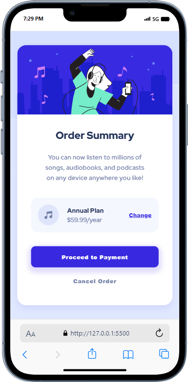
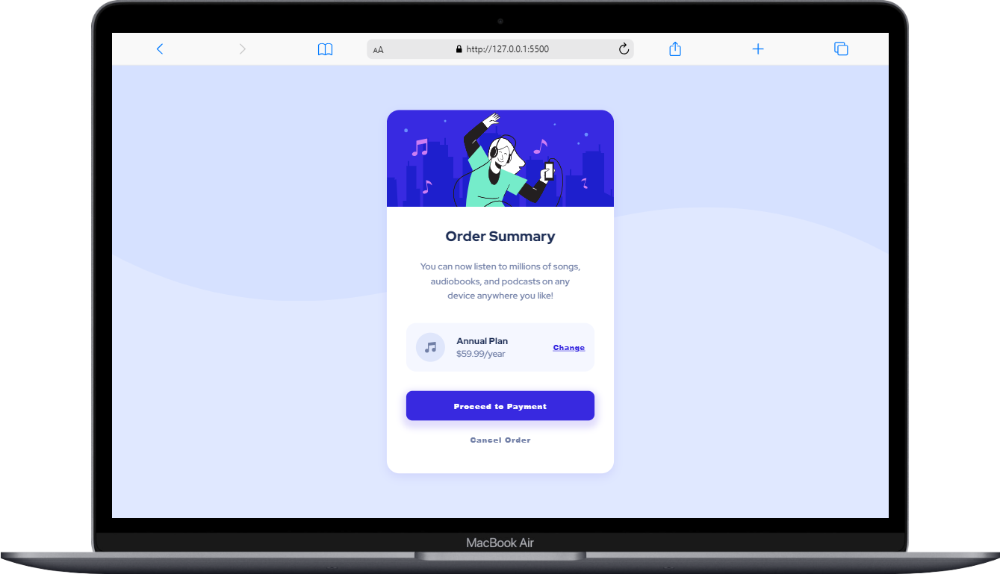

# Frontend Mentor - Order summary card solution

This is a solution to the [Order summary card challenge on Frontend Mentor](https://www.frontendmentor.io/challenges/order-summary-component-QlPmajDUj). Frontend Mentor challenges help you improve your coding skills by building realistic projects.

## Table of contents

`

- [Overview](#overview)
  - [The challenge](#the-challenge)
  - [Screenshot](#screenshot)
  - [Links](#links)
- [My process](#my-process)
  - [Built with](#built-with)
  - [What I learned](#what-i-learned)
  - [Continued development](#continued-development)
- [Author](#author)

## Overview

### The challenge

Users should be able to:

- See hover states for interactive elements

### Screenshot

| Mobile Design                                | Desktop Design                                 |
| -------------------------------------------- | ---------------------------------------------- |
|  |  |

### Links

- Solution URL: [solution URL](https://github.com/asmaahamid02/order-summary-component)
- Live Site URL: [live site URL](https://your-live-site-url.com)

## My process

### Built with

- Semantic HTML5 markup
- CSS custom properties
- Flexbox
- Mobile-first workflow

### What I learned

I learned the concept of Mobile-first workflow and how to use it in my projects. I also learned how to customize the responsive design to fit very small screens.

### Continued development

I will continue to learn more about responsive design and how to make my projects more responsive. I will also learn more about the Mobile-first workflow and how to use it in my projects.

## Author

- Website - [Asmaa Hamid](https://www.your-site.com)
- Frontend Mentor - [@asmaahamid02](https://www.frontendmentor.io/profile/asmaahamid02)
- LinkedIn - [Asmaa Hamid](https://www.linkedin.com/in/asmaa-hamid-4656a4288/)
- Instagram - [@asmaa.codes](https://www.instagram.com/asmaa.codes/)
- TikTok - [@asmaa.codes](https://www.tiktok.com/@asmaa.codes)
